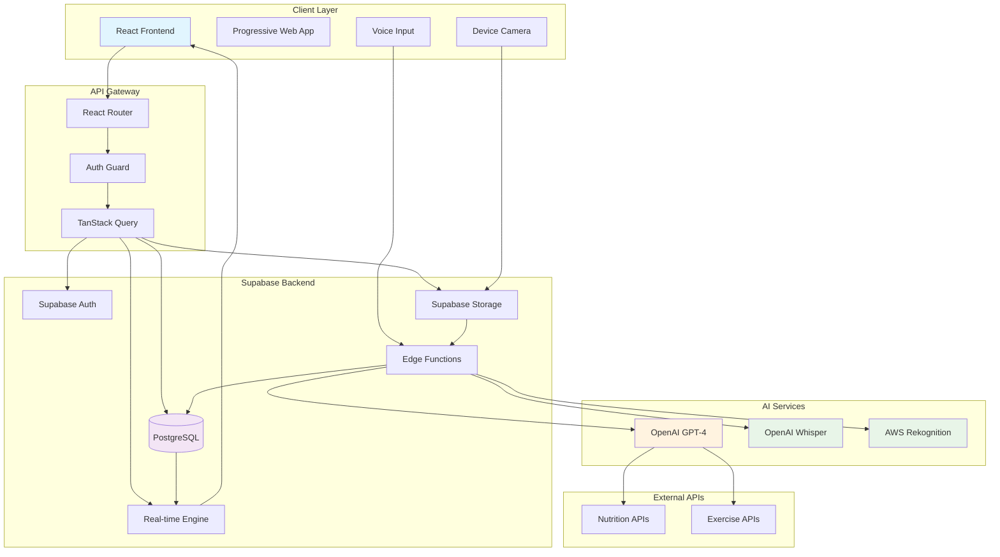
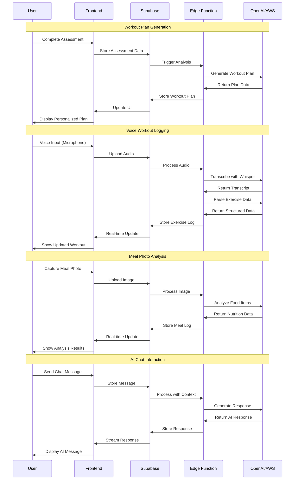
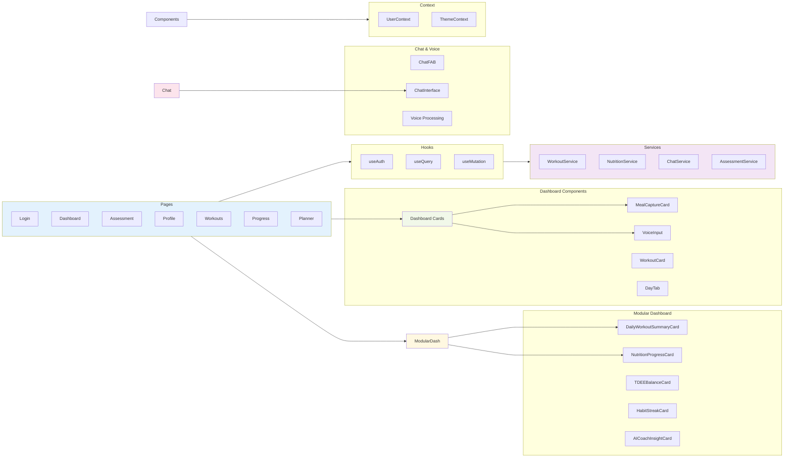
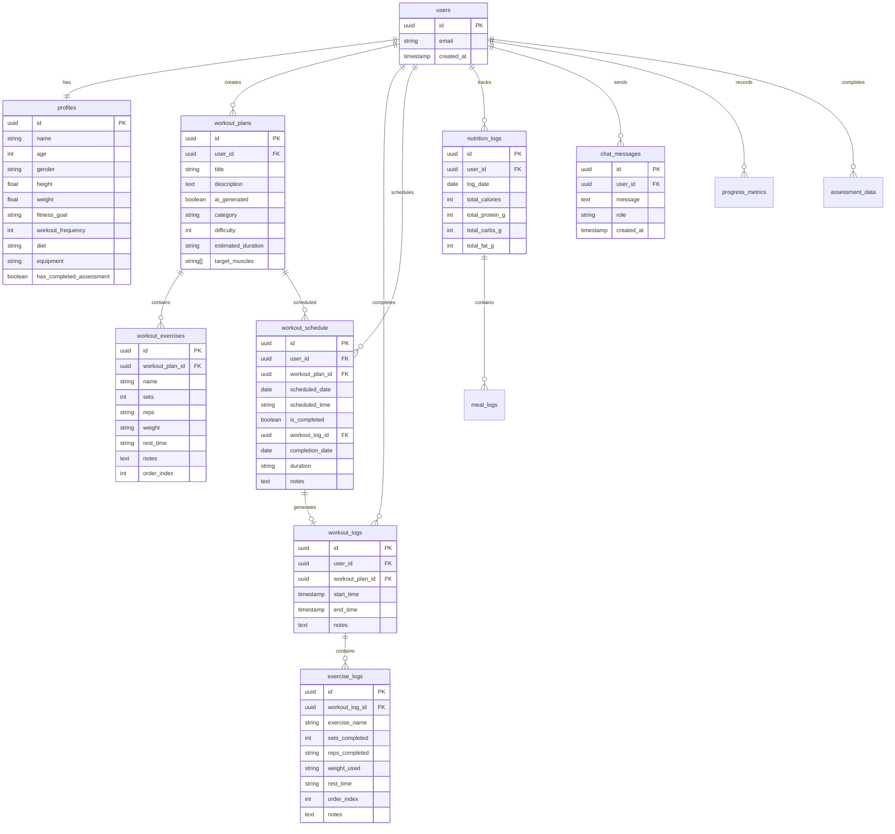
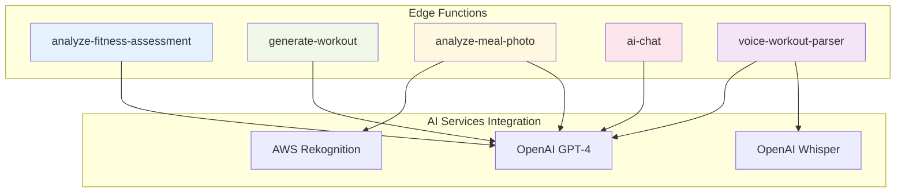

# Architecture Diagram
## Hashim - AI-Powered Personal Fitness Trainer

### System Architecture Overview

### Data Flow Architecture

### Component Architecture

### Database Schema Relationships

### Edge Functions Architecture

