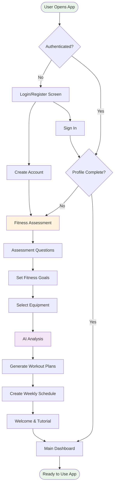
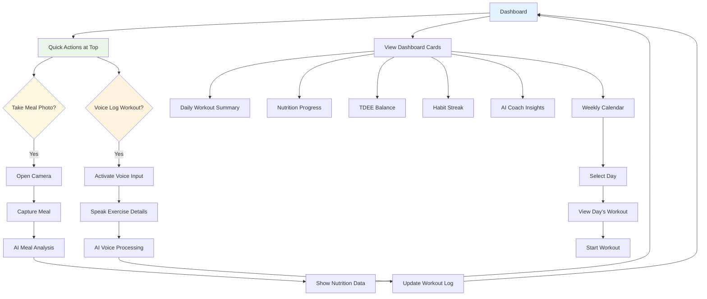
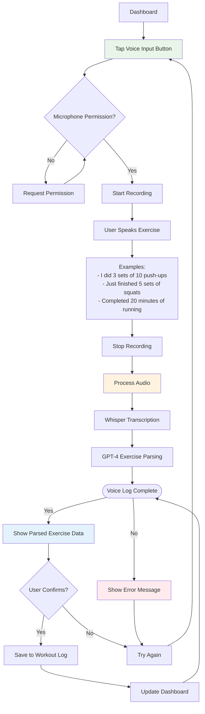
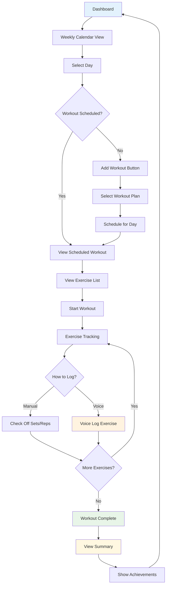
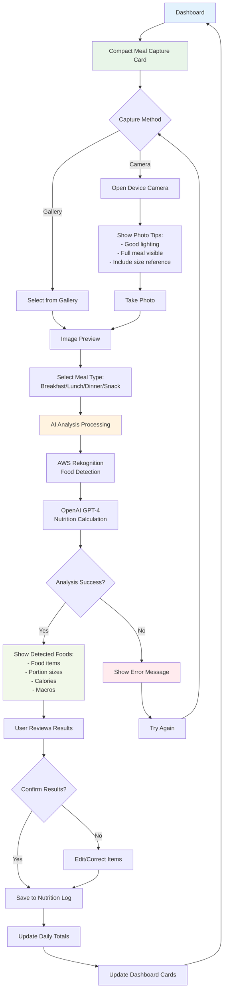
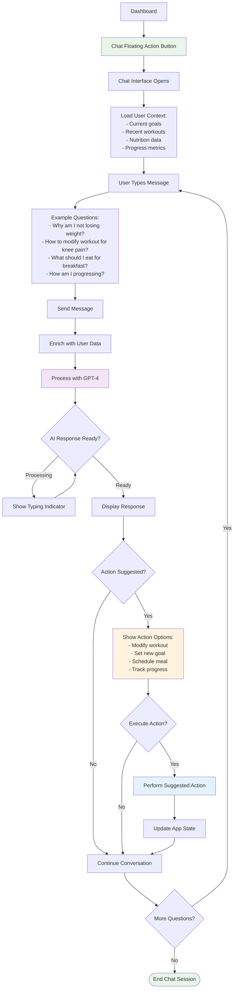
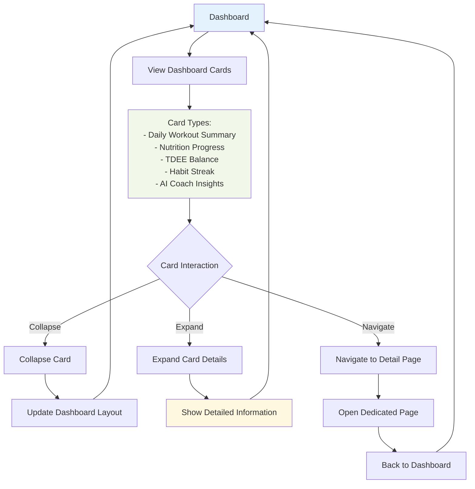
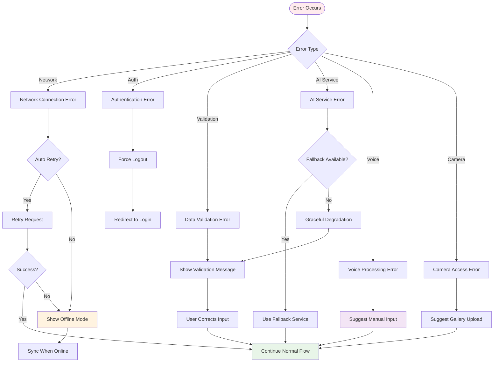

# User Flow Diagrams
## Hashim - AI-Powered Personal Fitness Trainer

### User Onboarding Flow

### Daily Dashboard Flow

### Voice Workout Logging Flow

### Workout Tracking Flow

### Meal Logging Flow

### AI Chat Flow

### Dashboard Card Interaction Flow

### Error Handling Flow

### Key User Journeys Summary

#### New User Journey
1. **Discovery**: User finds app through marketing or referral
2. **Registration**: Creates account with email/password
3. **Assessment**: Completes comprehensive fitness questionnaire with goals
4. **Personalization**: AI generates customized workout plans and schedules
5. **First Interaction**: Guided through dashboard and quick actions
6. **First Workout**: Experiences voice logging or manual tracking
7. **First Meal**: Uses camera for meal analysis
8. **Habit Formation**: Daily engagement with compact dashboard interface

#### Daily Active User Journey
1. **Quick Check-in**: Opens app to compact dashboard view
2. **Quick Actions**: Uses top-placed meal capture or voice logging
3. **Dashboard Review**: Checks collapsible cards for progress
4. **Workout Execution**: Completes scheduled workout with real-time tracking
5. **Progress Tracking**: Reviews weekly analytics and achievements
6. **AI Interaction**: Asks questions or seeks guidance through chat

#### Voice-First User Journey
1. **Voice Workout Logging**: Primary method for exercise tracking
2. **Natural Language**: Speaks exercises in conversational format
3. **Instant Feedback**: Sees parsed data and confirmation
4. **Continuous Logging**: Builds habit of voice-based interaction
5. **Progress Visualization**: Tracks voice-logged exercises in dashboard

#### Re-engagement Journey
1. **Push Notification**: Receives workout reminder or progress update
2. **Quick Return**: Uses compact interface for fast interaction
3. **AI Motivation**: Receives encouraging message and adjusted plan
4. **Flexible Restart**: Uses voice logging for quick workout updates
5. **Consistency Building**: Maintains regular usage with minimal friction

#### Power User Journey
1. **Advanced Planning**: Uses weekly planner for workout scheduling
2. **Detailed Tracking**: Combines voice, manual, and photo logging
3. **Analytics Deep Dive**: Reviews comprehensive progress metrics
4. **AI Coaching**: Regular interaction with AI assistant for optimization
5. **Goal Evolution**: Adjusts goals and plans based on progress data
