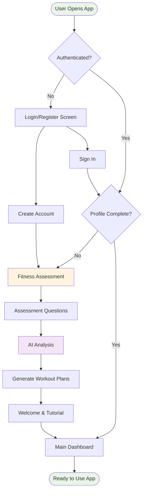
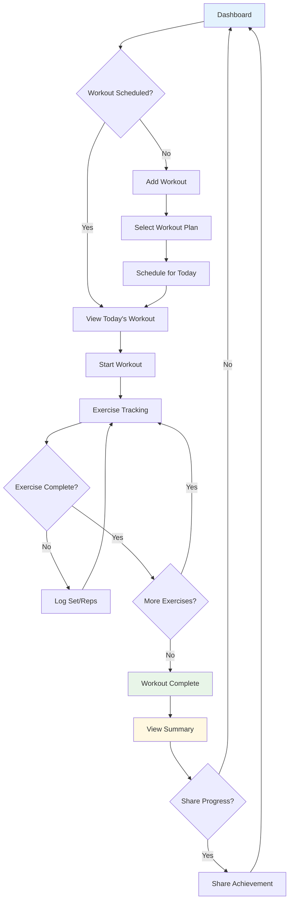
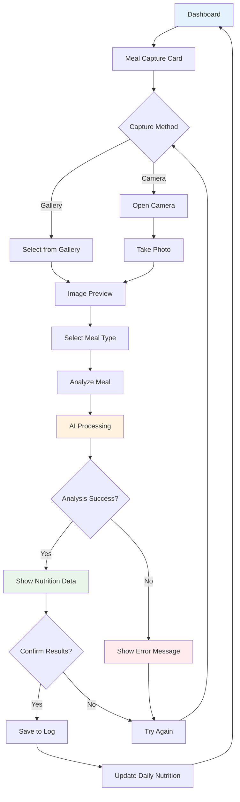
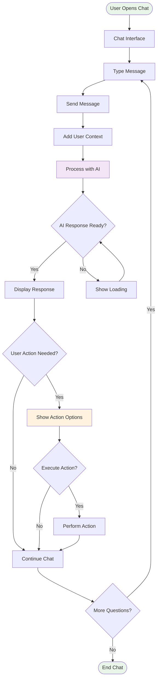
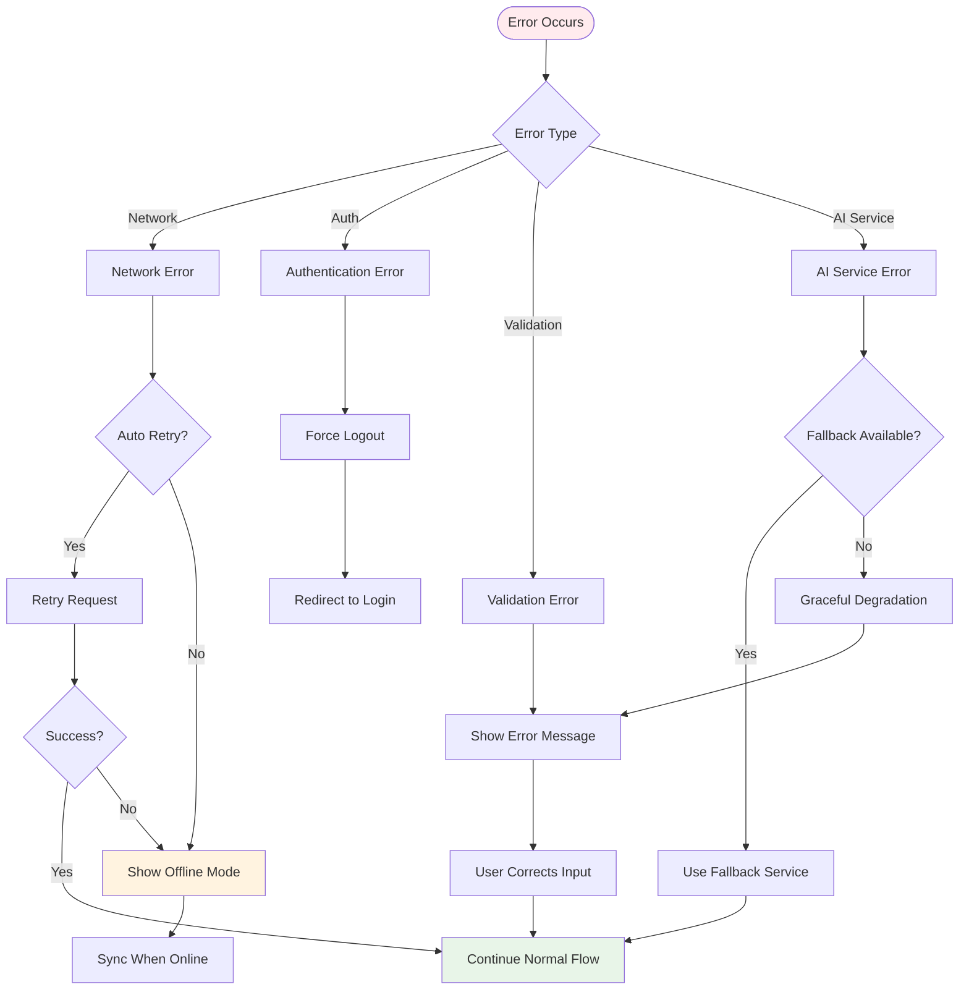

# User Flow Diagrams
## Hashim - AI-Powered Personal Fitness Trainer

### User Onboarding Flow

### Daily Workout Flow

### Meal Logging Flow

### AI Chat Flow

### Error Handling Flow

### Key User Journeys Summary

#### New User Journey
1. **Discovery**: User finds app through marketing or referral
2. **Registration**: Creates account with email/password
3. **Assessment**: Completes comprehensive fitness questionnaire
4. **Personalization**: AI generates customized workout plans
5. **First Workout**: Guided through first workout experience
6. **Habit Formation**: Daily engagement with workouts and nutrition

#### Daily Active User Journey
1. **Check-in**: Opens app to view daily dashboard
2. **Workout**: Completes scheduled workout with progress tracking
3. **Nutrition**: Logs meals through photo analysis
4. **Chat**: Asks AI assistant for guidance or motivation
5. **Progress**: Reviews weekly progress and achievements

#### Re-engagement Journey
1. **Notification**: Receives reminder about missed workout
2. **Return**: Opens app to catch up on activities
3. **Motivation**: AI provides encouraging message and adjusted plan
4. **Restart**: Resumes workout routine with modified schedule
5. **Consistency**: Maintains regular usage pattern
